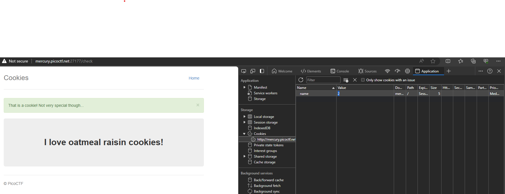

---
tags:
    - picoCTF
    - web exploitation
---

## Resources

### Developer tools documentation

* [Firefox](https://developer.mozilla.org/en-US/docs/Learn/Common_questions/Tools_and_setup/What_are_browser_developer_tools)
* [Edge](https://learn.microsoft.com/en-us/microsoft-edge/devtools-guide-chromium/overview)

## where are the robots

An introduction to robots instructions.

<details>
<summary><b>Walkthrough</b></summary>

1. Load the [site](https://jupiter.challenges.picoctf.org/problem/36474/)
1. Ok it is a pretty simple site, lets have alook at the source to see if there is any more to it
```
CTRL+SHIFT+i
```
1. Yes - this confirms very simple site - so the challenge will probably be realted to the namesake.
1. We know about `robots.txt` - lets visit it
1. just add `\robots.txt` to the url...
1. Interesting - we have a Disallow what does that [mean](https://developers.google.com/search/docs/crawling-indexing/robots/create-robots-txt)?
```txt
disallow: [At least one or more disallow or allow entries per rule] A directory or page, relative to the root domain, 
that you don't want the user agent to crawl. If the rule refers to a page, it must be the full page name as shown in the browser. 
It must start with a / character and if it refers to a directory, it must end with the / mark.
```
1. Ok - the developer wants to hide that directory, so lets go there 
1. Did you find a [flag?](https://jupiter.challenges.picoctf.org/problem/36474/477ce.html)

</details>

## Power Cookie

This one is a good introduction to cookies

<details>
<summary><b>Walkthrough</b></summary>

1. Start the instance, and opena browser to the link given
1. Open up your dev tools
```
CTRL+SHIFT+i
```
1. Navigate over to the `Application` tab and open up `Storage -> Cookies`
1. Look at the cookies for the site


1. notice the cookei `isAdmin` waht is its value? (`0`)
1. Try changing the value, right click on the value and select `Edit "Value"`
1. When you have changed the value, reload the page by hitting `F5`

</details>

## Insp3ct0r

You are now in a position to solve this 

<details>
<summary><b>Walkthrough</b></summary>

1. Start the instance, and opena browser to the link given
1. Open up your dev tools
```
CTRL+SHIFT+i
```
1. Navigate over to the `Sources` tab and explore

</details>

## Cookies

A bit of a step up, but helps understand cookies and their role.

<details>
<summary><b>Walkthrough</b></summary>

1. First we need to load the [site](http://mercury.picoctf.net:27177/)
1. OPen up developer mode
```
CTRL+SHIFT+i
```
1. Navigate over to the `Application` tab and open up `Storage -> Cookies`



1. We can see the `Name` and `Value` pairs - note that text content is stored in [base64](../lessons/lesson_03.md)
1. There is only one cookie on this site named `name` - look at the value (`-1`)
1. Enter `snickerdoodle` in the `search` field
1. Observe the cookie value now (`0`)
1. Lets see what happens when we edit the value. In the developer window, right click on the value and select `Edit "Value"`
1. Change it to `1` and reload the page using `f5`
1. The maximum value is 28 - see if you can find the right value...

</details>

<details>
<summary><b>Lazy? Walkthrough Extension</b></summary>

```txt
write python3 to connect to the website "http://mercury.picoctf.net:27177/check" 
and supply a cookie named "name" the values from 0-28 in a loop and print the result
```

</details>

Some [working code to solve this](../../src/pico_cookies.py)


