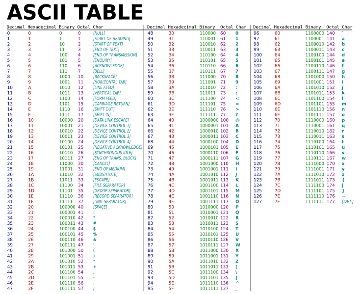

---
tags:
    - lesson
    - encoding
    - general
---
# 02 Character encoding

## Objectives

Work through the picoCTF general playlist to learn

1. Binary and encoding 
1. Shell navigation and commands
1. Python

## Last lesson we learnt

1. Binary - a computer stores data in raw 0 and 1. 
    * A single 0 or 1 is a bit
    * 8 is a byte
    * 1024 is a kilobyte
1. numeric *representation* in differnt number bases (2,10,16) - they all represent the exact same underlying binary value in the computer but look different.
1. *encoding* - a means of using binary to store text values. There are differnt encoding schemes, the most common in English is ASCII (7bit) now superseded by UTF-8 (8 bit)

## Lab

Open up [picoCTF and login](https://play.picoctf.org/)

Work through the [general playlist](https://play.picoctf.org/playlists/14?m=89)

Use the [lab guides](../labs/pico_playlist_general_1.md)

