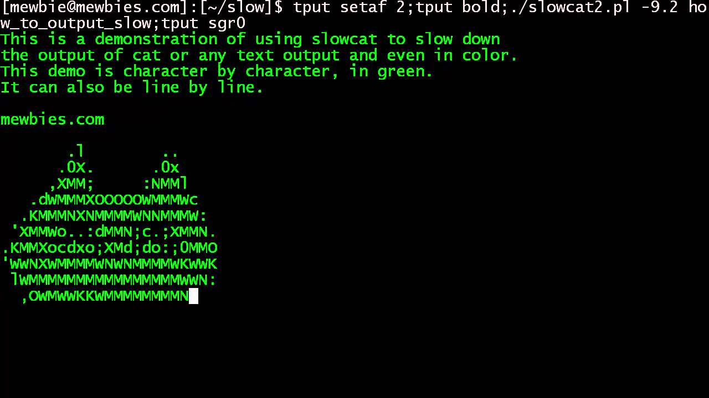

---
tags:
    - lesson
    - essential-skills
---

# 03 - Base64

## Objectives 

1. Understand base64
1. Finish off the general challenges in picoCTF

## Labs

1. Finish off general playlist  [Skills II problems 3 has nice walkthroughs!](../labs/pico_playlist_general_2.md)
1. A simple base64 challenge [bases](https://play.picoctf.org/practice?originalEvent=1&page=1&search=bases)

## Expected base knowledge

We need to be getting a good at these foundational skills: 

### Computing fundamentals

1. A computer stores information in binary 
1. Understanding number representation in computers
1. Understanding the same number can be represented in different bases (binary, octal, decimal, hexadecimal)
1. Familiar with basic charachter encding (ASCII, UTF-8)

For more information:

* [Number systems tutorial with Python](https://www.geeksforgeeks.org/number-system-in-python/)
* [What is charachter encoding](https://www.geeksforgeeks.org/what-is-character-encoding-system/)

### Linux terminal skills

1. Navigating directories `ls, cd, mkdir, pwd`
1. Finding help `man man` or try `<command> -h`
1. Viewing content of a file `cat`
1. Viewing permissions `ls -la`
1. Changing permissions `chmod`
1. Downloading a file `wget`
1. Accessing another system `nc, ssh`
1. Examine file type `file`
1. Using tab to complete a line
1. Using up arrow to load the last line(s) executed

### [CyberChef](https://gchq.github.io/CyberChef/)

1. Load input
1. Add recipies
1. Load an existing recipie

### Python

1. Execute python
1. Use the Python interactive shell

## But I dont feel like a 1337 hax0r?

If you need to strengthen your foundations:

1. Watch the pico general skills [video1](https://www.youtube.com/watch?v=3OawXnTELqA) and [video2](https://www.youtube.com/watch?v=FJ9le5rFGnA)
1. Finish all the picoCTF general skills challenges
1. Ask for help!!!

## Base64

A binary to text encoding. That means it can stuff any sequence of bits into a text representation of those bits.

For more on the topic see [this good write up](https://www.freecodecamp.org/news/what-is-base64-encoding/).

### Why it exists

To avoid the interpretation of bytes as instructions (special or control charachters) by a system/protocol handling the data.

### Why know it

Base64 is exceptionally common in challenges. 
 
### How it is used

1. Email attachments are typically encoded - this was the first use case for base64
1. It is used allot in web data transfers
1. Storing binary data inside a text based system (like a web cookie)

### Some tests

Try decoding `WW91IGFyZSBhd2Vzb21lIOKcqAo=`

With
1. [CyberChef](https://gchq.github.io/CyberChef/)
1. [ChatGPT](https://chatgpt.com/)

Now - complete the lab [bases](https://play.picoctf.org/practice?originalEvent=1&page=1&search=bases)