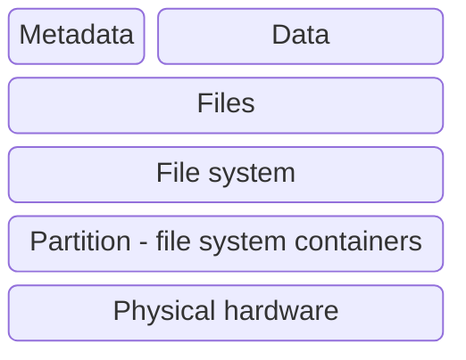

---
tags:
    - lesson
    - forensics
---

# Intro to Forensics

Forensics is the discovery of data that proves or disproves a hypothesis.

It is really challenging to not leave a digital fingerprint behind. 

The systems are generating more artefacts of forensic use as they 
increase their support of conveniance and security.

We use forensics to find out:

* what happened
* who did it

## Resources and labs

1. Look at the [training videos in picoCTF](https://play.picoctf.org/playlists/16?m=114)
1. CTF101 on [forensics](https://ctf101.org/forensics/overview/)
1. [labs - pico forensics playlist](../labs/pico_playlist_forensics.md)

## The big picture

A file on a your computer constist typically of metadata and data.

That file sits on top of a filesystem  - the filesystem defines how to allocate data blocks for a 
file and recover them again when required, and delete that data when not needed. 

The volume or partition is a logical conatiner for a filesystem, so that a file system can span 
physical devices or have many filesytems on one device.

The physical media contais the raw storage media and presents the ability address data blocks and access those blocks for reading and writing.

## File forensics

A file is a sequence of bytes that represents some type of data. The file typically has some bytes to show what type of file it is, 
some metatdata, and the data itself.

### File formats

A program will try and process a data file based on how it is programmed to process the bytes in the file. Often the operating system uses the filename extension to know what application to use to load the file.

Different file formats can be very differnt. They include bytes in a file as plain text, more complex text formats like docx, executable files (exe, dll, so, ...), images (jpeg, png...), and even files that are another filesystem of files (iso).

#### Magic bytes

For an application to confirm what type of file it has loaded, it will read the first bytes of the file, which contains a common signature per file format known as the magic bytes.

THis sequence of bytes at the start of a file uniquely identifies the file type. The file extensions, like `.jpeg` is a helper, but is just part of the name of the file on the file system. For example if you take a hash of  file and change the filename, the hash remeains the same.

### Metadata

Many more complex file types contain data metadata, that is , data about the data within. THis may include timestamps, comments, author, and them=n more specific data for the format itself, such as size of the image or where it was taken.

## File systems

The file sytem is a logical manager of data files on disk. It has its own attributes such as file magic, metadata about itself, then data about the files, such as where they are, when they got there, how big they are.

### File system forensics

The file system leaves allot of history of old files, and remnants of old data. We may cover some of this later.

## Tools

### File forensics

On Linux the following tools will be you first points of call

#### Metadata

1. `file` to display what type of data is in the file by the magic bytes
1. `exiftool` to dump metadata of an image and many other file types
1. `objdump` to dump data and other attributes of executable files

#### Analysing content

1. `strings` to extract data from a binary format
1. `xxd` to vieew the hex representation of a file content. THis is useful as many data formats will use 
byte values, versus text, to represent some things, as they are not intended for raw human consumtion.
Pipe `xxd` to a program like `head` to view file magic. e.g. `xxd filename | head`
