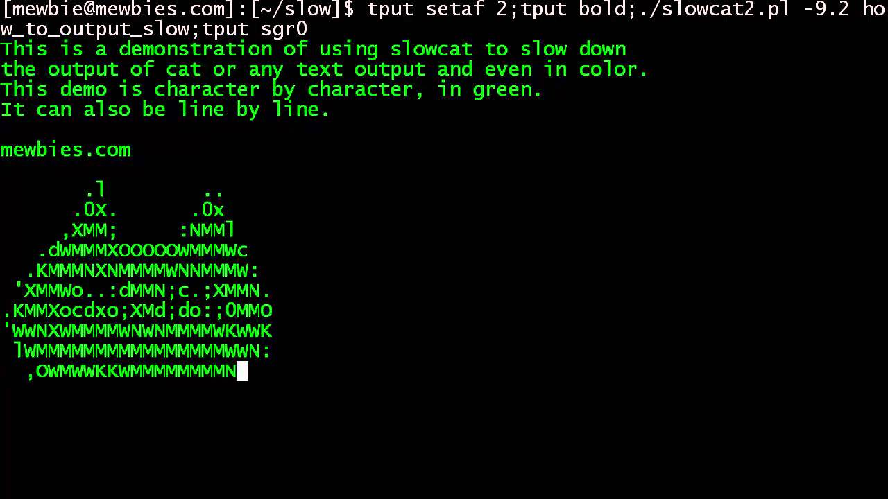

### Linux terminal skills

Go to the [linux terminal page](./linux_shell.md)

### [CyberChef](https://gchq.github.io/CyberChef/)

1. Load input
1. Add recipies
1. Load an existing recipie

### Python

1. Execute python
1. Use the Python interactive shell