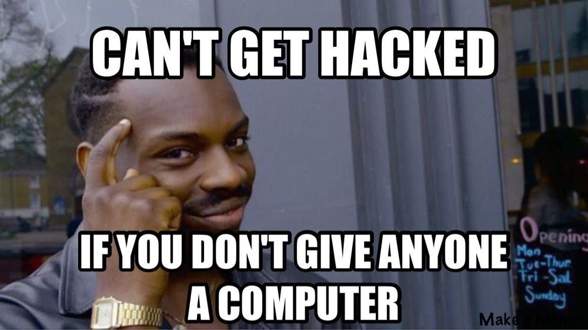

# Welcome to PECAN training!

Welcome to the first week of PECAN training. The aim of these training sessions is to get you ready to compete, but most importantly, you will learn some valuable skills along the way.


# Objectives

1. [Why learn cyber security](#about-cyber-security)
1. [Ethical hacking](#ethical-hacking)
1. [Understand CTF](labs/_about_ctf.md)
1. [set up hacking station](labs/_about_hacking_station.md)
1. [set up pico ctf account](labs/_about_picoctf.md)
1. [pico playlist - general](labs/pico_playlist_general.md)

# About cyber security
Our objective with these modules is to learn more about cyber security and have fun doing it!

Cyber security typically involves the CIA of data:
> 1. **Confidentiality** - my data can only been seen by those authorised.
> 1. **Integrity**- my data can only be changed by those authorised.
> 1. **Availability** - I can access my data when I need it.

Different data types and uses typically vary in sensitivity across the three. For example, weather information may be available publically, but it causes major issues when it is unavailable. Whereas, the secret position of a Submarine could be missed for a bit, but undermines the safety of people if its confidentiality is broken.

Participating in this series will give you some skills to protect your data, and an idea of what a career in cyber can include.





# Ethical hacking

Hacking now refers to unauthorised computer access, this is colloquially known as _blackhat hacking_.  **Breaking into computers is wrong (illegal) when not authorised.**  For example, according to the [Cybercrime Act 2001 parts 10.7](https://www.legislation.gov.au/C2004A00937/latest) 

```
478.1  Unauthorised access to, or modification of, restricted data

 (1) A person is guilty of an offence if:

    (a) the person causes any unauthorised access to, or modification of, restricted data; and

    (b) the person intends to cause the access or modification; and

    (c) the person knows that the access or modification is unauthorised; and

    (d) one or more of the following applies:

        (i) the restricted data is held in a Commonwealth computer;

        (ii) the restricted data is held on behalf of the Commonwealth;

        (iii) the access to, or modification of, the restricted data is caused by means of a telecommunications service.

Penalty: 2 years imprisonment.

 (2) Absolute liability applies to paragraph (1)(d).

 (3) In this section:

    restricted data means data:

    (a) held in a computer; and

    (b) to which access is restricted by an access control system associated with a function of the computer.
 ```

However, without understanding how the systems are broken into, or testing the controls in place, we are struggling to defend our data as cyber security professionals. So with approprate approvals in place, that is you have written approval to exploit a security control(s), ethical hacking is the application of cyber dark arts to ensure we can protect our systems from those who wish to do them harm.

You will learn some techniques that can be used in the hacking of systems. This is a privilige not to be abused.

